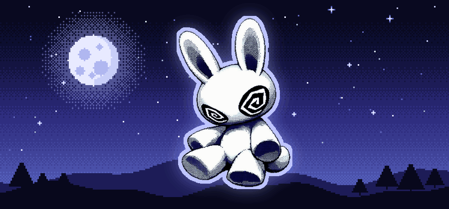

  

  

### 🌀 Sobre mí

- 🎮 Ahora mismo: trabajando en varios proyectos (iré subiendo más)
- 🌱 Aprendiendo: más cosas de programación y diseño pixel art
- 🐰 Estética favorita: halftone, Game Boy y todo lo *creepy-cute*

✦ Un secreto (haz clic) ✦

 
El conejo del espiral me mira mientras programo. No sé si es buena señal.

### 🔗 Mis redes

  &nbsp;&nbsp;
  &nbsp;&nbsp;
  &nbsp;&nbsp;

### 🎧 Ahora mismo suena...

  

### 📊 Stats

  
  

 

